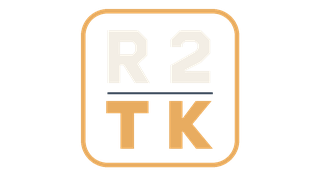

# Resistance 2 Tool Kit for PS3



**By Guidjlk.** An offline, controller-operated prototype for managing Resistance 2 cosmetic unlock files, with original-file backup and restore.

Requires a PS3 with custom firmware (CFW), **BCUS98120**, update **1.60**, and its original, unpatched installed EBOOT. This application does not run on stock PS3 firmware. Other regions and versions are unsupported.

## Download

Get **Resistance-2-Tool-Kit-0.1.9.pkg** from the [latest release](https://github.com/Guidjlk/resistance-2-toolkit-ps3/releases/latest). Install it on your CFW PS3 or in RPCS3 using the instructions below. Source code, credits, licenses and the changelog accompany the release.

## Features

See [Changelog](CHANGELOG.md) for the application history.

- Individual selections for Collector Wraith, Malikov, Grim, Rachael Parker, Female Soldier, Ravager, Cloven, Ranger Variation and Black Ops Variation.
- Automatic backup before the first change, without a separate backup step.
- **Revert to Original** restores your starting unlock state, saved before the first **Apply Selection**, including previously installed DLC.
- Preserve unlock files that already existed before the first backup.
- Detect changed files and interrupted operations before applying further changes.

The six additional character skins use EDAT unlock files. Wraith, Malikov and Grim use empty DAT markers. Maps and their assets are not included. Campaign bonuses, save editing, archive editing and executable patching are outside this prototype.

## Install and use on PS3

1. Install Resistance 2's official 1.60 update and use its original installed executable. Close the game.
2. Copy `Resistance-2-Tool-Kit-0.1.9.pkg` to a FAT32 USB drive. Install it using your CFW's package manager, then launch **Resistance 2 Tool Kit** from the XMB. Keep CFW syscalls enabled while launching homebrew. If the application is already installed, install the newer PKG over it; its separate unlock backup is retained.
3. Select the desired cosmetics and choose **Apply Selection**. Confirm with Cross and wait for the completion message. The application automatically records which of the nine unlock files already existed and preserves their contents before the first change.
4. Exit the application, launch Resistance 2 and inspect its multiplayer skins and Wraith appearance.

Use the D-pad to navigate (hold Up or Down to scroll), **Cross** to toggle a selection or choose an action, **Square** to select/deselect all, **Triangle** for credits, and **Circle** to cancel or request exit. Pressing Circle from the main menu or selecting **Exit** opens a confirmation: **Cross** exits and **Circle** stays in the application. Circle still returns from credits and cancels other confirmations. Applying an unchecked selection removes only a marker added by this application; existing original unlock files are always retained.

## Restore and remove

**Revert to Original** is grayed out until a valid automatic backup is available.

Close the game, open the application, select **Revert to Original**, and confirm. This restores your game's unlock state from before the tool first applied changes. The automatic backup is taken immediately before the first **Apply Selection**, not merely when the application first opens. **Original** means your own starting state, including any DLC already installed at that time; it does not mean a fresh game installation without DLC. Files that already existed are restored and toolkit-added markers are removed. The backup remains available for later use. Restore before deleting the application if you want to undo its unlock-file changes; deleting its XMB entry alone does not undo those changes.

The automatic backup is stored outside the application at `/dev_hdd0/R2TK_BACKUPS/BCUS98120_0160`. It is kept unchanged across application updates and reverts. Keep this folder so **Revert to Original** can restore the initial unlock state.

To reset the restore point for a fresh start, first choose **Revert to Original** and confirm it succeeds, then exit the application. Using a PS3 file manager or FTP, delete only `/dev_hdd0/R2TK_BACKUPS/BCUS98120_0160`. The next **Apply Selection** creates a new automatic backup from the unlock files present at that time. Deleting the backup while toolkit unlocks are still installed makes those files part of the next starting state. If reverting fails or an operation was interrupted, keep the backup until the issue is resolved.

If an operation is interrupted, reopen the application and choose **Revert to Original** before applying another selection. If it reports a conflict or invalid backup, retain the backup folder and resolve that issue before continuing.

Backup and restore cover only the nine unlock marker files, including whether each file originally existed. They are not full game, console or save backups. The application reads the game executable to identify the supported version but never modifies it, saves or game archives.

## Existing DLC

Unlock files present before the first automatic backup are preserved, whether their options are checked or unchecked. **Revert to Original** keeps those files and removes only toolkit additions. Account activation and licenses are not edited. The Aftermath map pack, its entitlement file and map assets are outside this application's scope.

The restore point is the state before the first use, not a continuously updated record of installed DLC. Install your existing DLC before using the application. If you install or reinstall DLC afterwards, avoid reverting against the old backup until that changed state has been reviewed; new entitlement files can cause a conflict, and identical empty DAT markers cannot reveal who installed them.

## RPCS3

Install the PKG through **File → Install Packages/Raps/Edats**, then launch its game-list entry. Resistance 2's original BCUS98120 update 1.60 must be installed in the same emulator's `dev_hdd0/game/BCUS98120` folder. Disable executable unlock patches while comparing the effects of the marker files. The application shows this reminder when its read-only process check recognizes RPCS3. Detection is a best-effort hint and does not change unlock or backup behavior. Configure a controller, or use your configured keyboard pad buttons.

## Build from source

Use [PS3DK](https://github.com/FirebirdTA01/PS3DK) v0.21.0, CMake 3.20 or newer, and Ninja. On Windows, run:

```powershell
./build.ps1 -SdkRoot 'C:/path/to/ps3-sdk-v0.21.0-windows-x86_64'
```

The build writes a signed application SELF, a debug PKG and a finalized `.gnpdrm.pkg` under `build/output`. The distributed install package uses the finalized PKG. SDK tools must be available through the supplied SDK directory; no game executable or save is needed to compile the checked-in marker data.

`tools/make_icon.py` optionally regenerates the transparent XMB icon from `assets/icon.svg` using Python and Pillow. The ready-to-use PNG is included for normal builds.

`tools/generate_assets.py` is an optional authoring utility, requiring Python and PyCryptodome, for regenerating the marker data from a separately supplied original BCUS98120 1.60 decrypted ELF. It does not include that executable. Generated marker data is already included for normal builds.

## Credits and license

Original application code: **Guidjlk**, [GPL-2.0-only](LICENSE). See [CREDITS.md](CREDITS.md) for third-party references and licenses. This is an unofficial project; Resistance 2 belongs to Insomniac Games and Sony.

The application works offline and contains no analytics, network requests, console-ID collection or account-ID collection.
